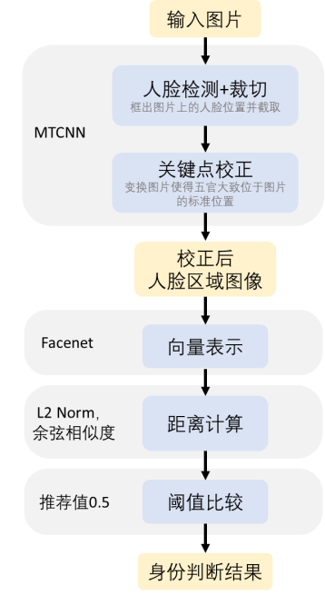

# 环境配置
使用Python版本3.12。创建新conda环境后运行如下安装命令。

Linux:
```
# 二选一：使用CUDA
pip install torch==2.2.2 torchvision==0.17.2 torchaudio==2.2.2 --index-url https://download.pytorch.org/whl/cu121
# 二选一：使用CPU
pip3 install torch==2.2.2 torchvision==0.17.2 torchaudio==2.2.2 --index-url https://download.pytorch.org/whl/cpu

# 无论CUDA或CPU，都需要的库
pip3 install facenet-pytorch opencv-python seaborn fastapi 'uvicorn[standard]' colored_traceback python-multipart scikit-learn colorama natsort retinaface-pytorch schedule onnxruntime flask ultralytics
pip3 install --only-binary :all: insightface
```

# 启动说明
1. cd进入项目目录
2. 运行如下命令，启动服务
 ```
 export PYTHONPATH=项目文件夹所在路径:$PYTHONPATH
 python ./a003_fastapi/a001_main.py
 ```
 若要挂在后台运行，可将第二条命令改为 "nohup python ./a002_main/a004_fastapi/a001_main.py > output.log 2>&1 &"
# 使用说明
可调整的参数在CONFIG.py中修改。

仓库结构:
1. a001_test 一些新特性的demo，开发过程中测试使用。
2. a002_model 模型定义、训练、测试。
   1. a001_utils 被多次复用的工具。其中data_dict.py用于读取数据集的所有图像路径。general_utils.py是处理数据的工具。logger.py用于自定义输出日志的格式。
   2. a002_batch_test 测试模型。
   3. a003_training 训练模型。
3. a003_fastapi 搭建服务。
4. a004_add_data_label 一个尚在开发中的图形界面，用于标注人脸数据。

处理流程:

